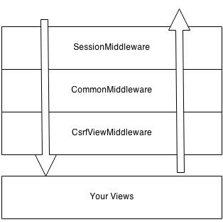

# django

---

# About Me

Douglas Mendizábal

* OpenStack developer at Rackspace

* CloudKeep - [https://github.com/cloudkeep](https://github.com/cloudkeep)

* GitHub - [https://github.com/dmend](https://github.com/dmend)

* Twitter - @dev_doug

---

# Django

“Django is a high-level Python Web Framework that encourages rapid development and clean, pragmatic design.”

* [https://www.djangoproject.com/](https://www.djangoproject.com/)

## It’s not MVC, it’s…

* Models
* Templates (Views)
* Views (Controllers)

---

# Django

## “Elegant URL design”
* [Cool URIs don’t change!](http://www.w3.org/Provider/Style/URI.html)
*  Uses regular expressions for url matching

## Built-in ORM
* SQL: Postgres, MySQL, SQLite, etc.

## Everything AND the Kitchen Sink!
* Admin Interface
* Authentication
* Development Web Server

---

# Django is Big

* Django has awesome docs!

* [https://docs.djangoproject.com/en/1.6](https://docs.djangoproject.com/en/1.6)

* The Tutorial is a great introduction

---

# Request Handling

* Request is handled by the server
* Django URL configuration routes the request to the view
* View renders the response

Can be extended with __Middleware__

* Authentication/Authorization
* Caching
* CSRF protection

---

# Django

---

# Middleware

* Handles pre-processing and post-processing of request

---

# Installing Django

Latest version 1.6.2 was released on Feb 2, 2014

    !bash
    $ pip install django

---

# Begin a new project

    !bash
    $ django-admin.py startproject bookstore

    $ tree bookstore
    bookstore
    ├── bookstore
    │   ├── __init__.py
    │   ├── settings.py
    │   ├── urls.py
    │   └── wsgi.py
    └── manage.py

---

# Add your first app

    !bash
    $ python manage.py startapp inventory

    $ tree
    .
    ├── bookstore
    │   ├── __init__.py
    │   ├── settings.py
    │   ├── urls.py
    │   └── wsgi.py
    ├── inventory
    │   ├── __init__.py
    │   ├── admin.py
    │   ├── models.py
    │   ├── tests.py
    │   └── views.py
    └── manage.py

* Don't forget to add to settings

---

# URLConf

* Uses Regular Expressions for URL matching
* You can pass regex groups as parameters to your view

        !python
        from django.conf.urls import patterns, include, url
        from django.contrib import admin
    
        admin.autodiscover()

        urlpatterns = patterns('',
            # http://bookstore.com
            url(r'^$', 'inventory.views.home'),
            # http://bookstore.com/book/12345
            url(r'^book/(\d+)/$', 'inventory.views.detail'),
            # http://bookstore.com/admin/*
            url(r'^admin/', include(admin.site.urls)),
        )

---

# Models

* Each model is a Python class that subclasses django.db.models.Model
* Each attribute of the model represents a database field

        !python
        from django.db import models

        class Author(models.Model):
            first_name = models.CharField(max_length=256, blank=True)
            last_name = models.CharField(max_length)

        class Book(models.Model):
            author = models.ForeignKey(Author)
	        title = models.CharField(max_length=256)
	        release_date = models.DateField(null=True)

        # python manage.py syncdb

---

# Django ORM

* Using ORM

        !python
        # python manage.py shell
        >>> from inventory.models import *
        >>> b = Book(title='Two Scoops of Django')
        >>> b.save()
		>>> Book.objects.create(title='How to Avoid Huge Ships')
        <Book: Book object>
		>>> Book.objects.all()
		[<Book: Book object>, <Book: Book object>]

		>>> Book.objects.get(pk=1)
		<Book: Book object>

		>>> Book.objects.filter(title__contains='Django')
        [<Book: Book object>]

        >>> Book.objects.filter(author__last_name__istartswith='P')

---

# Security - SQL Injection

* By using the Django ORM you get protection from SQL Injection for free!
* Values sent to the ORM are escaped based on your database backend
* You can execute raw SQL if you need to, but be careful!

		!python
        # DON'T DO THIS!
		>>> Book.objects.raw(
            'SELECT * FROM myapp_book WHERE title = %s' % title
        )

        # Do this instead
        >>> Book.objects.raw(
            'SELECT * FROM myapp_book WHERE title = %s', [title]
        )

---

# View Functions

* A view is a Python function that takes a Web request and returns a Web response

		!python
        from django.http import HttpResponse, HttpResponseNotFound

		def my_view(request):
		    # ...
		    if foo:
		        return HttpResponse('<h1>Page found!</h1>')
		    else:
		        return HttpResponseNotFound('<h1>Page not found</h1>')

---

# View Functions

* Views define which data you see, not how you see it

		!python
        from django.http import HttpResponse, Http404
        from django.shortcuts import render_to_response

        from inventory.models import Book

        def detail(request, isbn):
            try:
                b = Book.objects.get(pk=isbn)
            except Book.DoesNotExist:
                raise Http404
            return render_to_response('detail.html', {'book': b})

---

# Templates

* Django’s template engine provides a powerful mini-language for defining the user-facing layer of your application

		!html
		<!DOCTYPE html>
		<html>
        <!-- base.html template -->
		<head>
			<title>Book Detail</title>
		</head>
		<body>
            
		    <h1>{{ book.title }}</h1>
            
		        
Released on  {{ book.release_date }}.

            
            
		</body>
		</html> 

Not limited to HTML

---

# Templates

* Templates are reusable

		!python
		 

		
		The current time
		 

		 
		
It is now {{ current_date }}.
 
		

---

# Security - Cross Site Scripting (XSS)

* All variables output by the template engine are escaped 
* Django provides a ‘safe’ filter to bypass protection if you need to

		!python
		{{ name|safe }}

---

# Forms

    !python
    from django import forms

    class BookOrderForm(forms.Form):
        title = forms.CharField(max_length=100)
        customer_name = forms.CharField()
        customer_email = forms.EmailField()

---

# Use form in a view function

    !python
    def contact(request):
        if request.method == 'POST':
            form = BookOrderForm(request.POST)
            if form.is_valid():
                # Process form data
                # ...
                return HttpResponseRedirect('/thanks/')
        else:
            form = BookOrderForm()
        
        return render(request, 'contact.html', {
                'form': form,
        })

---

# Use from in a template

    !html
    <form action="/order/" method="post">
        
        {{ form.as_p }}
        <input type="submit" value="Submit" />
    </form>

---

# Security - Cross Site Request Forgery

* Easy to use
* Not on by default
* Add the middleware

		!python
		'django.middleware.csrf.CsrfViewMiddleware'

* In any template that uses a POST form use 
		
		!python
		<form action="." method="post">
			

---

# CSRF cont...

* In the corresponding view functions, ensure that the csrf context processor is being used.  One way of doing this is using RequestContext
		
		!python
		def view(request):
		    #...
		    return render_to_response('book.html', {'book': book},
                    context_instance=RequestContext(request))

---

# Demo

---

# Questions?
