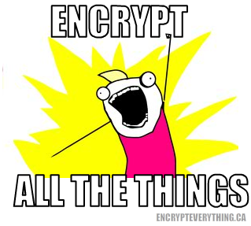

# Intro to GPG and the Trusted Web

---

# About Doug

- Barbican Team
- Alamo City Python Group

---

# What is GPG?

- PGP - Pretty Good Privacy
- Written by Phil Zimmermann in 1991
- OpenPGP - ITEF - [RFC 4880](http://www.rfc-editor.org/rfc/rfc4880.txt)
- GnuPG - GPG - GNU Privacy Guard

---

# Is GPG secure?

- Strong Cryptography

## Provides

- Confidentiality
- Integrity
- Nonrepudiation

- Authenticity

---

# Confidentiality

- Message can't be viewed by anyone who does not have the necessary keys, algorithms and tools.

---

# Integrity

- Refers to keeping a message unchanged.  With GPG you can confirm a message has not been tampered with.

---

# Nonrepudiation

- Means a person cannot deny signing a particular message.

---

# Authenticity

- Confidentiality + Integrity + Nonrepudiation

- If you receive a message that is encrypted and signed, then you can be sure
 that the contents have been kept private, the message has not been tampered
 with and the message was sent by someone who has the right to send it in
 the senders name.

---

# How does GPG achieve that?

Using crypto!

---

# Hash

[Plaintext] -> HASH -> [Digest]

    Attack on Pearl Harbor December 7.
    700531cb1b91e0ca72c34eb4a0936f014dc276ba7bd43705bc0ab98190002e44

    Attack on Pearl Harbor December 8.
    edb5488ab437ebf064e9a0f905bcd57b1e1c7196c8dec3e156f62facf39f14c4

---

# Symmetric Encryption

- Symmetric because it uses the same key for both operations

[Plaintext] + [KEY] -> ENCRYPTION -> [Ciphertext]

[Ciphertext] + [KEY] -> DECRYPTION -> [Plaintext]

---

# Asymmetric Encryption

- Split KEY in two
    - KEY A
    - KEY B

[Plaintext]  + [KEY A] -> ENCRYPTION -> [Ciphertext]

[Ciphertext] + [KEY B] -> DECRYPTION -> [Plaintext]
 
---

# Public-Key Encryption

- Same as Asymmetric encryption, but you give away one of the key halves
    - Public Key
    - Private Key

- GPG uses keyservers to share public keys

---

# Digital Signatures

- Create a hash of the message
- Encrypt the hash with your private key
- Attach encrypted hash to document

---

# GPG Uses Public-Key Encryption

## GPG Keys

- "Key" - File in your computer
- Passphrase - Make sure it's not easy to guess!

- GPG Uses two key pairs by default
    - Master key used for signing
    - Subkey used for encription
- GPG Keys are tied to a User ID 
    - Legal Name (Comment) <email@address.com>
- Fingerprint
- Key ID (last 8 digits of fingerprint)

---

# Where should I install it?

* Linux - Comes preinstalled with most distros
* Windows - [http://www.gpg4win.org/](http://www.gpg4win.org/)
* Mac OS - [https://gpgtools.org/](https://gpgtools.org/)

---

# Key Generation

    gpg --gen-key
    gpg (GnuPG/MacGPG2) 2.0.22; Copyright (C) 2013 Free Software Foundation, Inc.
    This is free software: you are free to change and redistribute it.
    There is NO WARRANTY, to the extent permitted by law.

    Please select what kind of key you want:
    (1) RSA and RSA (default)
    (2) DSA and Elgamal
    (3) DSA (sign only)
    (4) RSA (sign only)
    Your selection? 1

---

# Key Generation - key length

    RSA keys may be between 1024 and 8192 bits long.
    What keysize do you want? (2048) 4096
    Requested keysize is 4096 bits

---

# Key Generation - expiration
    
    Please specify how long the key should be valid.
    0 = key does not expire
    <n>  = key expires in n days
    <n>w = key expires in n weeks
    <n>m = key expires in n months
    <n>y = key expires in n years
    Key is valid for? (0) 
    Key does not expire at all
    Is this correct? (y/N) y

---

# Key Generation - UID

    GnuPG needs to construct a user ID to identify your key.

    Real name: Joe Racker
    Email address: joe.racker@rackspace.com
    Comment: Work e-mail                   
    You selected this USER-ID:
    "Joe Racker (Work e-mail) <joe.racker@rackspace.com>"

    Change (N)ame, (C)omment, (E)mail or (O)kay/(Q)uit? o

---

# Key Generation - Passphrase

- The safest place for your passphrase is in your head.
- If your key file is compromised, they would still need the passphrase to use.

---

# GPG Key

    pub   4096R/60783624 2014-02-24
        Key fingerprint = 43D8 6D83 989B F675 35F0  F0D6 6BFF 6681 6078 3624
    uid                  Joe Racker (Work e-mail) <joe.racker@rackspace.com>
    sub   4096R/EA81CC9B 2014-02-24

- Be sure to backup your key!

- Createa revocation certificate

---

# My Public Key

    $ gpg --fingerprint 2D58923C

    pub   4096R/2D58923C 2013-11-22
        Key fingerprint = 245C 7B6F 70E9 D8F3 F5D5  0CC9 AD14 1F30 2D58 923C
    uid                  Douglas Mendizabal (Douglas Alejandro Mendizábal Vásquez) <douglas@redrobot.io>
    uid                  Douglas Mendizabal (Douglas Alejandro Mendizábal Vásquez) <dougmendizabal@gmail.com>
    uid                  Douglas Mendizabal (Racker) <douglas.mendizabal@rackspace.com>
    sub   4096R/B91C25A2 2013-11-22
    sub   4096R/2098B5FB 2013-11-22

---

# Publishing your key

    gpg --key-server pgp.mit.edu --send-keys 60783624

---

# The Web of Trust

---

# Trust

- In PGP Trust is when you sign someone else's private key to affirm that
  you have verified that person's identity.

- When someone signs your key, they are saying that they've confirmed your 
  identity.

- When you sign someone else's key, you're telling the world that you're 
  positive of the identity of the key owner.

---

# How to get your key signed

- Friends
- Co-workers
- Keysigning parties (rax.io)

---

# Use your key to send email

---

# Encrypted email

---

# Decrypted email

---

# Summary

---

# References

- PGP & GPG: Email for the Practical Paranoid
  by Michael Lucas (No Starch Press)
- The GNU Privacy Handbook
  [http://www.gnupg.org/gph/en/manual.html](http://www.gnupg.org/gph/en/manual.html)
