# Intro to GPG and the Web of Trust

---

# About Doug Mendizábal

- Software Developer at Rackspace

- OpenStack Barbican PTL
- Alamo City Python Group
- [github.com/dmend](http://github.com/dmend)

---

# History PGP

- Pretty Good Privacy (PGP)
    - Phil Zimmerman, 1991
    - SB 266
- OpenPGP, 1998
    - [RFC 4880](https://tools.ietf.org/html/rfc4880)
- GNU Privacy Guard
    - GnuPG or GPG

---

# Meet Alice and Bob

- Alice wants to send Bob a messages that only he can read
- Bob wants to make sure the message came from Alice
- Bob wants to know that the message has not been altered in transit

---

# Bob and Alice can use GPG!

## GPG provides

- Confidentiality
- Integrity
- Nonrepudiation
- Authenticity

---

# Confidentiality

- Message can't be viewed by anyone who does not have the necessary keys, algorithms and tools.

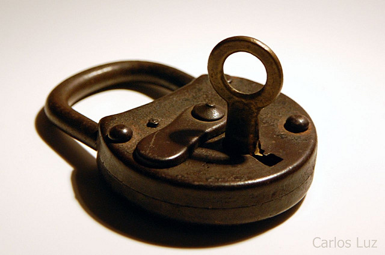
[1]

---

# Integrity

- Refers to keeping a message unchanged.  With GPG you can confirm a message has not been tampered with.

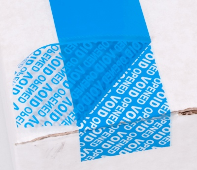

---

# Nonrepudiation

- Means a person cannot deny signing a particular message.

---

# Authenticity

- Confidentiality + Integrity + Nonrepudiation

- If you receive a message that is encrypted and signed, then you can be sure
 that the contents have been kept private, the message has not been tampered
 with and the message was sent by someone who has the right to send it in
 the senders name.

---

# How does GPG achieve that?

Using crypto!

- GPG uses strong cryptography

---

# Hash

Example SHA-256

    !python
    "Attack on Pearl Harbor December 7."
    700531cb1b91e0ca72c34eb4a0936f014dc276ba7bd43705bc0ab98190002e44

    "Attack on Pearl Harbor December 8."
    edb5488ab437ebf064e9a0f905bcd57b1e1c7196c8dec3e156f62facf39f14c4

---

# Symmetric Encryption

- Symmetric because it uses the same key for both encryption and decryption

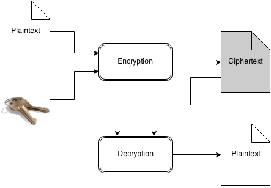

---

# Asymmetric Encryption

- We use a key pair - two keys that are related to each other

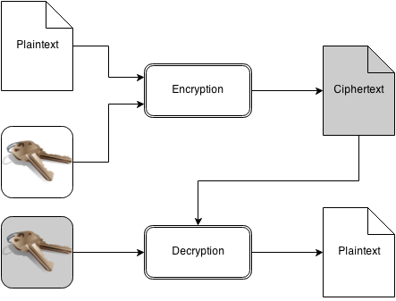

---

# Public-Key Encryption

- Same as Asymmetric encryption, but we give each key a role:
    - Public Key - One key is published for anyone to copy and keep
    - Private Key - The other key is kept secret

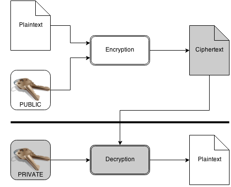

---

# Digital Signatures

Digitally signing a document combines Hashing and Public Key Encryption

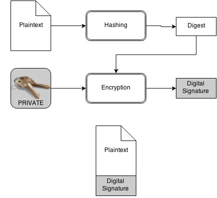

---

# Digital Signatures

Anyone who has the Public Key can verify the signature

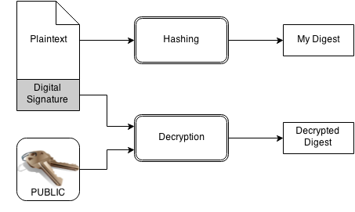

---

# Key Management

---

# Who's got what keys?

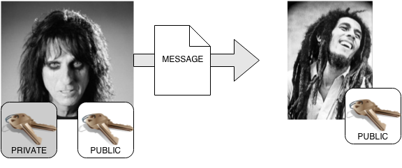

- Alice sends a message to Bob

---

# Who's got what keys?

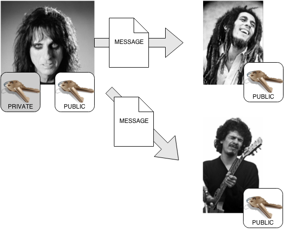

- Alice sends messages to either Bob or Carlos

---

## GPG Keys

- Keys are stored locally in a key database
    - gpg --list-keys ( gpg -k )
    - gpg --list-secret-keys ( gpg -K )
- Your private key has a Passphrase - Make sure it's not easy to guess!
- Keys have a unique Fingerprint
    - Key ID (last 8 digits of fingerprint)
- GPG Keys actually consist of many crypto keys
    - GPG Uses two key pairs by default
        - Master key used for signing
        - Subkey used for encription
- GPG Keys must have at least one User ID
    - Legal Name (Comment) <email@address.com>

---

# My Public Key

    $ gpg --fingerprint 2D58923C

    pub   4096R/2D58923C 2013-11-22
        Key fingerprint = 245C 7B6F 70E9 D8F3 F5D5  0CC9 AD14 1F30 2D58 923C
    uid                  Douglas Mendizábal (Douglas Alejandro Mendizábal Vásquez) <mail@doug.gt>
    uid                  Douglas Mendizabal (Douglas Alejandro Mendizábal Vásquez) <douglas@redrobot.io>
    uid                  Douglas Mendizabal (Racker) <douglas.mendizabal@rackspace.com>
    uid                  Douglas Mendizabal (Douglas Alejandro Mendizábal Vásquez) <dougmendizabal@gmail.com>
    sub   4096R/B91C25A2 2013-11-22
    sub   4096R/2098B5FB 2013-11-22

---

# Key Generation

## $ gpg --gen-key

    gpg (GnuPG/MacGPG2) 2.0.22; Copyright (C) 2013 Free Software Foundation, Inc.
    This is free software: you are free to change and redistribute it.
    There is NO WARRANTY, to the extent permitted by law.

    Please select what kind of key you want:
    (1) RSA and RSA (default)
    (2) DSA and Elgamal
    (3) DSA (sign only)
    (4) RSA (sign only)
    Your selection? 1

---

# Key Generation - key length

    RSA keys may be between 1024 and 8192 bits long.
    What keysize do you want? (2048) 4096
    Requested keysize is 4096 bits

---

# Key Generation - expiration

    Please specify how long the key should be valid.
    0 = key does not expire
    <n>  = key expires in n days
    <n>w = key expires in n weeks
    <n>m = key expires in n months
    <n>y = key expires in n years
    Key is valid for? (0)
    Key does not expire at all
    Is this correct? (y/N) y

---

# Key Generation - UID

    GnuPG needs to construct a user ID to identify your key.

    Real name: Joe Racker
    Email address: joe.racker@rackspace.com
    Comment: Work e-mail
    You selected this USER-ID:
    "Joe Racker (Work e-mail) <joe.racker@rackspace.com>"

    Change (N)ame, (C)omment, (E)mail or (O)kay/(Q)uit? o

---

# Key Generation - Passphrase

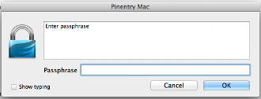

- The safest place for your passphrase is in your head.
- If your key file is compromised, they would still need the passphrase to use.

---

# GPG Key

    pub   4096R/60783624 2014-02-24
        Key fingerprint = 43D8 6D83 989B F675 35F0  F0D6 6BFF 6681 6078 3624
    uid                  Joe Racker (Work e-mail) <joe.racker@rackspace.com>
    sub   4096R/EA81CC9B 2014-02-24

---

# Create a revocation certificate

    $ gpg --gen-revoke 60783624 --output revocation-certificate.asc

- Be sure to backup your key and revocation cert!

---

# Sharing your key

    gpg --export --armor 60783624 > public_key.asc

    gpg --key-server pgp.mit.edu --send-keys 60783624

---

# Use your key to sign email

    -----BEGIN PGP SIGNED MESSAGE-----
    Hash: SHA512

    Hi TechTalk!

    - -Doug
    -----BEGIN PGP SIGNATURE-----
    Version: GnuPG/MacGPG2 v2.0.22 (Darwin)

    iQIcBAEBCgAGBQJUQULrAAoJEB7Z2EQgmLX7zWcP/2wOQEMZLu0fPrKcIRL1TYr+
    jYDkA86A+40pt5tCRurA0xLHuQQ31apz6joVAbBgFMlj1tRvC+efAxwaeCgRmVbG
    xifoiDgS5kfwcp74xvdL3mV2rWDtWGjZ/a13B3zHOfMbzaqkVF6JR3PiIunYvGfH
    vJDbmKE+5NbBmqGv2mZzILIuYOupA+OPv4zbYXPHBKLZEDFHEtNrh1HA84JMtIXL
    NCMBnvNIK3JXGqsvFfchLpSExxPqigd33iJSEngrVnmXFLMeXkvktk2lshYe+JVh
    iRLGEIwqIHSSK4hxYa6BLcHNg+JeFUyeVMkZjoO1KRC4gAfvU75/YhX9GMun3JFT
    HjCY2ZEO+jGy1tAkVg5IkN+XJS1I990vmfPYjTjgY/VRWebb90ZxDosY6p9IrO0S
    i+8/XOqHpSrOLaUXbkB5i7CFu9fE9lyQkBAjabSLZ+6edvZfvC3HvWvLJmJ4gkpk
    zIn1wx236IisyRjxcqnYEX6DV9g9LRlVQBeseh1vNUNCKOh7DrmL8Sq+7Uzgp1ZH
    MDOZ06fxeRon0tUY+VgSvCHx+RXw2wIgKwPK/l+siDmZ71Ogg7wvd/+bsF2WQLoI
    scqybvrhA3L2xYm0WtrnXEKM8zmkXb95AevTbRTnrFh/vu23F+CiXc6vVRPAubNF
    py29OtsQgLn6UisTkoA7
    =vcYM
    -----END PGP SIGNATURE-----

---

# Use your key to sign files

## gpg --detach-signature filename

    filename
    filename.sig

## gpg --verify filename.sig filename

    gpg: Signature made Thu Oct 16 23:12:52 2014 CDT using RSA key ID 2098B5FB
    gpg: Good signature from "Douglas Mendizábal (Douglas Alejandro Mendizábal Vásquez) <mail@doug.gt>"
    gpg:                 aka "Douglas Mendizabal (Douglas Alejandro Mendizábal Vásquez) <douglas@redrobot.io>"
    gpg:                 aka "Douglas Mendizabal (Racker) <douglas.mendizabal@rackspace.com>"
    gpg:                 aka "Douglas Mendizabal (Douglas Alejandro Mendizábal Vásquez) <dougmendizabal@gmail.com>"

---

# Use your key to encrypt files

## gpg --encrypt filename -r &lt;KEY ID&gt;

    filename
    filename.gpg

## gpg --decrypt filename.gpg > filename

---

# Encrypted email

---

# Decrypted email

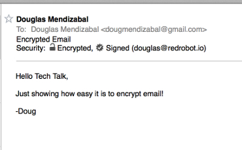

---

# The Web of Trust

---

# Trust

- In PGP Trust is when you sign someone else's private key to affirm that
  you have verified that person's identity.

- When someone signs your key, they are saying that they've confirmed your
  identity.

- When you sign someone else's key, you're telling the world that you're
  positive of the identity of the key owner.

---

# How to get your key signed

- Friends
- Co-workers
- Keysigning parties (rax.io)

---

# How to sign someone's key

## gpg --sign-key 60783624

- GPG will ask if you are sure?
- Signature is added to the other peroson's public key

---

# Listing all signatures on a key

## gpg --list-sigs 88746AB8

    pub   4096R/88746AB8 2005-05-07
    uid                  Igor Gueths (igueths) <igueths@lava-net.com>
    sig       X  1714E0F3 2005-05-17  [User ID not found]
    sig          5A1D3071 2007-08-15  [User ID not found]
    sig          F62F58B3 2011-09-02  [User ID not found]
    sig          CDC932AC 2014-08-04  [User ID not found]
    sig          8B7336D5 2014-01-27  [User ID not found]
    sig 3        2D58923C 2014-08-02  Douglas Mendizábal (Douglas Alejandro Mendizábal Vásquez) <mail@doug.gt>
    sig 3     X  3B9C3AA2 2005-05-07  [User ID not found]
    sig 3        88746AB8 2005-09-25  Igor Gueths (igueths) <igueths@lava-net.com>
    sig 3        88746AB8 2005-05-07  Igor Gueths (igueths) <igueths@lava-net.com>
    sig 3        88746AB8 2005-05-07  Igor Gueths (igueths) <igueths@lava-net.com>
    sig 2        CB676F29 2014-07-31  Tyler Duzan <tristor@gmail.com>
    sub   4096R/D59D3B3D 2013-08-25 [expires: 2015-08-25]
    sig          88746AB8 2013-08-25  Igor Gueths (igueths) <igueths@lava-net.com>

---

# Checking signatures

## gpg --check-sigs 88746AB8

    pub   4096R/88746AB8 2005-05-07
    uid                  Igor Gueths (igueths) <igueths@lava-net.com>
    sig!3        2D58923C 2014-08-02  Douglas Mendizábal (Douglas Alejandro Mendizábal Vásquez) <mail@doug.gt>
    sig!3        88746AB8 2005-09-25  Igor Gueths (igueths) <igueths@lava-net.com>
    sig!3        88746AB8 2005-05-07  Igor Gueths (igueths) <igueths@lava-net.com>
    sig!3        88746AB8 2005-05-07  Igor Gueths (igueths) <igueths@lava-net.com>
    sig!2        CB676F29 2014-07-31  Tyler Duzan <tristor@gmail.com>
    sub   4096R/D59D3B3D 2013-08-25 [expires: 2015-08-25]
    sig!         88746AB8 2013-08-25  Igor Gueths (igueths) <igueths@lava-net.com>

6 signatures not checked due to missing keys

---

# Managing trust

## gpg --edit-key 2D58923C

    [... snip key-details ...]

    gpg>trust

    [... snip key-details ...]

    Please decide how far you trust this user to correctly verify other users' keys
    (by looking at passports, checking fingerprints from different sources, etc.)

      1 = I don't know or won't say
      2 = I do NOT trust
      3 = I trust marginally
      4 = I trust fully
      5 = I trust ultimately
      m = back to the main menu

    Your decision?

---

# Refresh your keys

## gpg --refresh-keys

- Download updates from keyservers
    - New signatures
    - Revocations

---

# Criticism

- Awful UX
- No support for modern crypto

---

# Questions

---

# References

- PGP & GPG: Email for the Practical Paranoid
  by Michael Lucas (No Starch Press)
- The GNU Privacy Handbook
  [http://www.gnupg.org/gph/en/manual.html](http://www.gnupg.org/gph/en/manual.html)
